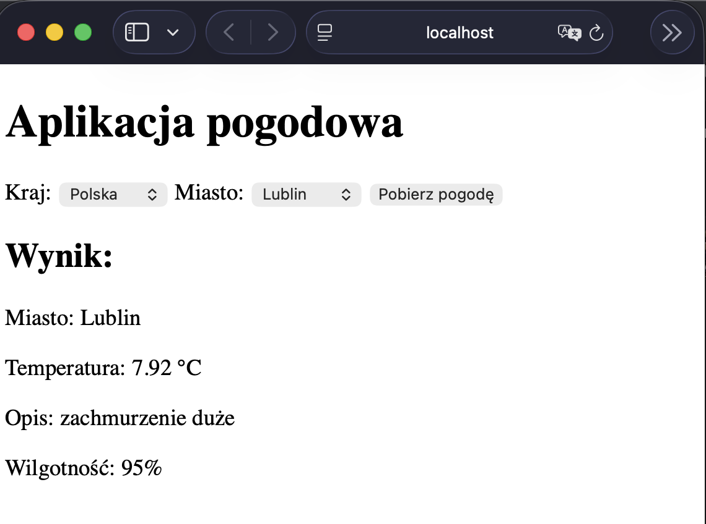

# Zadanie 1 PAwChO

Robert Horbaczewski

1. Aplikacja realizująca funkcjonalność z zadania. Wykonana w technologii Node.js z wykorzystaniem frameworka Express.

Frontent przygotowany w JavaScript oraz HTML.

server.js:
```javascript
const express = require('express');
const axios = require('axios');
const path = require('path');

// Utworzenie aplikacji Express
const app = express();

// Port, na ktorym aplikacja bedzie nasluchiwac
const PORT = 8080;

// Klucz API do komunikacji z API OpenWeather
const API_KEY = 'b90b0bd6be4ad04309ae3da24ee3b87b';

// Informacje wyswietlane w logach
console.log(`Data uruchomienia: ${new Date().toISOString()}`);
console.log('Autor: Robert Horbaczewski');
console.log(`Nasłuchiwanie na porcie TCP: ${PORT}`);

// Udostepnienie plikow statycznych z katalogu public
app.use(express.static('public'));

// Lista krajow i miast do wyboru w aplikacji
const locations = {
    Polska: ['Lublin', 'Wlodawa'],
    Finlandia: ['Helsinki', 'Somero']
};

// Mapowanie nazw na kody dla API OpenWeather
const countryCodes = {
    Polska: 'PL',
    Finlandia: 'FI'
};

// Endpoint pobierajacy aktualne informacje o pogodzie
app.get('/weather', async (req, res) => {
    try {
        const city = req.query.city;
        const country = req.query.country;
        const countryCodes = {
            Polska: 'PL',
            Finlandia: 'FI'
        };

        const countryCode = countryCodes[country];
        const url =
            `https://api.openweathermap.org/data/2.5/weather?q=${city},${countryCode}&appid=${API_KEY}&units=metric&lang=pl`;
        const response = await axios.get(url);
        const weatherData = {
            city: city,
            temperature: response.data.main.temp,
            description: response.data.weather[0].description,
            humidity: response.data.main.humidity
        };
        res.json(weatherData);
    } catch (error) {
        console.log(error.response?.data || error.message);
        res.status(500).json({
            error: 'Błąd pobierania pogody'
        });
    }
});

// Uruchomienie serwera aplikacji
app.listen(PORT, () => {
    console.log('Serwer działa poprawnie');
});
```

index.html:
```html
<!DOCTYPE html>
<html lang="pl">
<head>
    <meta charset="UTF-8">
    <title>Aplikacja pogodowa</title>
</head>
<body>

<!-- Naglowek aplikacji -->
<h1>Aplikacja pogodowa</h1>

<!-- Lista wyboru kraju -->
<label>Kraj:</label>
<select id="country">
    <option value="Polska">Polska</option>
    <option value="Finlandia">Finlandia</option>
</select>

<!-- Lista wyboru miasta -->
<label>Miasto:</label>
<select id="city">
    <option value="Lublin">Lublin</option>
    <option value="Wlodawa">Wlodawa</option>
</select>

<!-- Przycisk do pobrania danych pogodowych -->
<button onclick="getWeather()">Pobierz pogodę</button>

<!-- Wyswietlenie wyniku -->
<h2>Wynik:</h2>
<div id="result"></div>

<script>

// Lista miast dla poszczegolnych krajow
    const cities = {
        Polska: ["Lublin", "Wlodawa"],
        Finlandia: ["Helsinki", "Somero"]
    };

    // Pobranie elementow HTML odpowiedzialnych za wybor kraju i miasta
    const countrySelect = document.getElementById("country");
    const citySelect = document.getElementById("city");

    // Aktualizacja listy miast po zmianie kraju
    countrySelect.addEventListener("change", () => {

        const selectedCountry = countrySelect.value;

        // Usuniecie z listy poprzednich miast
        citySelect.innerHTML = "";

        // Dodanie nowych miast dla wybranego kraju
        cities[selectedCountry].forEach(city => {

            const option = document.createElement("option");

            option.value = city;
            option.text = city;

            citySelect.appendChild(option);

        });

    });

    // Funkcja pobierajaca dane pogodowe z backendu aplikacji
    async function getWeather() {

        const city = citySelect.value;
        const country = countrySelect.value;

        // Wyslanie zapytania HTTP do endpointu /weather
        const response =
            await fetch(`/weather?city=${city}&country=${country}`);

        // Odczyt odpowiedzi w formacie JSON
        const data = await response.json();

        // Wyswietlenie danych pogodowych
        document.getElementById("result").innerHTML = `
            <p>Miasto: ${data.city}</p>
            <p>Temperatura: ${data.temperature} °C</p>
            <p>Opis: ${data.description}</p>
            <p>Wilgotność: ${data.humidity}%</p>
        `;
    }

</script>

</body>
</html>
```

2. Dockerfile:
```dockerfile
# STAGE 1

# Obraz bazowy zawierający system Alpine i srodowisko Node.js
# AS build - nazwa nadana etapowi, zgodnie z dobrymi praktykami dla budowania wieloetapowego
FROM node:alpine AS build

# Deklaracja katalogu roboczego
WORKDIR /app

# Kopiowanie plików package.json i package-lock.json do obrazu Dockera
# Dzieki temu npm install wykona sie ponownie w przypadku zmiany zaleznosci w tych plikach - przy zmianie innych plikow wykorzystany zostanie cache
COPY package*.json ./

# Instalacja bibliotek wymaganych przez aplikacje Node.js
RUN npm install

# Kopiowanie do obrazu pozostalych plikow aplikacji
COPY . .

# STAGE 2

# Obraz bazowy zawierający system Alpine i srodowisko Node.js
FROM node:alpine

# Informacja na temat autora zgodna ze standardem OCI
LABEL org.opencontainers.image.authors="s101574@pollub.edu.pl"

# Deklaracja katalogu roboczego
WORKDIR /app

# Kopiowanie aplikacji z etapu 1.
COPY --from=build /app .

# Informacja o porcie wewnetrznym kontenera, na ktorym nasluchuje aplikacja
EXPOSE 8080

# Procedura Healthcheck - zautomatyzowana weryfikacja dzialania uruchomionej aplikacji
# Co 10 sekund wykonuje zapytanie HTTP do aplikacji
HEALTHCHECK --interval=10s --timeout=3s \
  CMD wget -q -O - http://localhost:8080 || exit 1

# Domyslne polecenie przy starcie kontenera
CMD ["npm", "start"]
```


3. Polecenia.

a) Budowanie opracowanego obrazu kontenera:
```bash
docker build -t zadanie1 .
```
b) Uruchomienie kontenera na podstawie zbudowanego obrazu:
```bash
docker run -d -p 8080:8080 --name zadanie1-container zadanie1
```
c) Uzyskanie informacji z logów:
```bash
docker logs zadanie1-container
```
d) Sprawdzenie, ile warstw posiada obraz i jaki jest obrazu:
```bash
docker history zadanie1
docker images
```

Działanie systemu w oknie przegkądarki:



